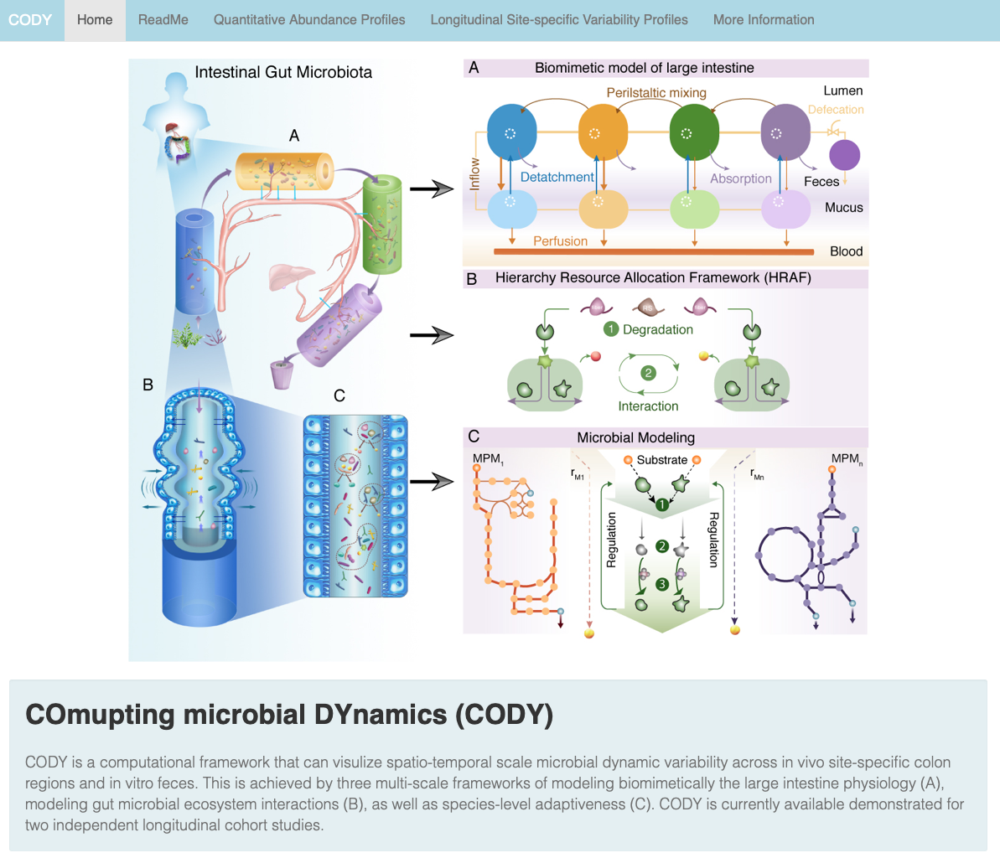

# CODY README:
# Computing the spatiotemproal dynamics of gut microbiota
Toolbox for Computing the spatiotemproal dynamics of gut microbiota (CODY), including quantitatively spatiotemporal resolution of variations in species-level abudance profiles, microbial composition, and metabolite-level profiles across site-specific regions of the in vivo colon feces, and plasma.

## Software and package Dependencies

* R for interactive with matlab and toolbox (we have tested this code for R version 3.5.0)
  -  Shiny   (Installation: install.packages("shiny"))
  -  reach (Installation: in R console command window, devtools::install_github("schmidtchristoph/reach/reach", force = TRUE))
  -  RStudio (RStudio version 1.1.442)

* R packages for results presentation
  -  ggplot2
  -  tidyverse
  -  grid
  -  reshape2
  -  tibble
  -  gridExtra
  -  stringr

* Matlab 2016b
  - This is required and called by R during calculation process.

## CODY Toolbox
```
1. Clone or download "CODY" toolbox package to local computer, open R, and navigate to CODY installation directory
```

```
2. Lanch Toolbox and Navigation
```
To **lanch** CODY toolbox on local computer, type the following command in your R console command window:

<p align=center font color=red>runAPP()</font></p>

CODY toolbox will launch!

The **Navigation Page** will look like this

<div align=center></div>
<br />

```
3. "Home" - CODY Methodology
```
The methodoloy overview of CODY is shown in the "Home" tab panel. 
Basically, CODY is composed by three multiscale frameworks that describe microbial growth in species-level, ecosystem-level, within site-specific colon regions including lumen and mucus.

<div align=center></div>

```
4. "ReadMe" - Guideline to run CODY and switch conditions
```
* Please follow the step-by-step readme guideline in the "ReadMe" tab panel. 
* In order to avoid re-run simulations, Please always select the "Cohort Catergory" at the beginning of a new round of simulations.
        
<div align=center></div>

Follow ReadMe guidelines before performing simulations. 

```
5. "Run Calculatioin" in  "Quantitative Abundance Profiles" Panel
```
## User Input 
**Implement simulations:** Choosing **"Cohort Catergory"**
* Select **Cohort Catergory** -- choose Infant/Adult
<div align=center></div>

* After cohort selection, **Diet Input** for each cohort would appear for user manipulations

**Diet composition:** array of average diet composition (g/day)

* Four kinds of microbial-accessible carbohydrates are involved

* Units in g/day, within the reasonable ranges specified

[example: infant cohort default settings]

```
Baseline:
         HMO  Mucin  Fiber  Resistant starch
          14    1     0          0
Diet-switch/intervention:
         HMO  Mucin  Fiber  Resistant starch
          0    1.5   12.5       10
...
```
  -  With default settings, users could reproduce results in the paper.
  <div align=center></div>

* Set diet composition for each period, for example:
  -  Here we will use the default settings of infant to show the consequent results
 
*  **Click "Run Calculation" button** on the right top, nearby **"Cohort Catergory"**.
  <br />
  <div align=center></div>
  <br />

* **Simulation would start, please wait.** The calculation process would last for 5~10 minutes. 
  -  A **process bar** would appear to R console, indicating how long each round of simulation would last:
  <br />

  <div align=center></div>
  <br />

  -  The simulation include both baseline and intervention periods. A second waitbar would indicate the intervention simulation starts:
  <br />

  <div align=center></div>
  <br />

  -  During the whole simulation process, the toolbox screen would look like this:
  <br />

  <div align=center></div>
  <br />

* After simulation finished, there would be a notification in the R console command window:
 <br />

 <div align=center></div>
 <br />

## Output I of CODY toolbox
After finishing calculations, multiple analysis results would present automatically upon user choices.
### **Select Output choice of** "Longitudinal Prediction of the site-specific profiles"
  -  "Colon Site" has 10 options:
     * "Lumen_I"   - acending lumen
     * "Lumen_II"  - transverse lumen
     * "Lumen_III" - descending lumen
     * "Lumen_IV"  - sigmoid lumen
     * "Mucosa I"  - acending mucosa
     * "Mucosa II" - transverse mucosa
     * "Mucosa III"- descending mucosa
     * "Mucosa IV" - sigmoid mucosa
     * "feces"     - feces
     * "Blood"     - plasma

  -  "Species" has two options:
     * "microbial"
     * "metabolite"

### Select **"Colon Site"** and **"Species"** to see the microbial/metabolite in the specific regions

The longitudinal microbial profiles in Lumen_I for infant cohort would shown in the screen:
<br />
<div align=center></div>
<br />

### Similarly, switch "Species" to "metabolite" to view the longitudinal metabolite profiles in "Lumen_II"
<br />
<div align=center></div>
<br />
       
## **Output II:** "Three-dimension Visulization"
* Select **"3D-Visulization"** to see the spatiotemporal profiles, here we show spatiotemporal Fpr profiles of infant cohort

<br />
<div align=center></div>
<br />       

## **Output III:** "Longitudinal in vitro Feces microbial relative abundance profiles"
* This result is comparable with metagenomics dataset, the results shown here is for infant cohort:
<br />
<div align=center></div>
<br /> 


## **Output IV:** Compare microbial/metabolite variability across multiple colon sites
### Navigating to tab panel of "Longitudinal Site-specific Variability Profiles"
* This page would enable to compare how microbial/metabolite changes across multiple colon sites.
* Select "Site Variable" as "microbial" and switch "In vivo Site-specific" to "lumen" for infant cohort. 
  -  "Site Variable" can vary among
      -  microbial/metabolite
  -  "In  vivo Site-specific"
      -  lumen
      -  mucosa
      -  feces
      -  blood

* The microbial levels acorss lumen sites would appear on the screen:

<br />
<div align=center></div>
<br /> 

* Similarly, Selet "metabolite" and "feces" to observe the SCFA levels changes in the feces:

<br />
<div align=center></div>
<br /> 

* Users can switch "Site Variable" and "In vivo Site-specific" to observe microbial/metabolite variability across colon sites at each stage.


## Additionally, **diet-manipulation** is available upon user choices
### Here shows an example of diet-manipulation
* Changing adult cohort diet regime by using the same composition at each stage as:
<br />
<div align=center></div>
<br /> 

* Following the same pipeline to run calculation:

* Observe the microbial profiles in "Colon Site" of "Lumen_I", almost the same
<br />
<div align=center></div>
<br /> 
* Observe the metabolite profiles in "Colon Site" of "Lumen_I", almost the same
<br />
<div align=center></div>
<br /> 
* Observe the microbial profiles in "Colon Site" of "feces", almost the same


### Feces microbial variability is also consistent with above under diet-manipulation
<br />
<div align=center></div>
<br />
